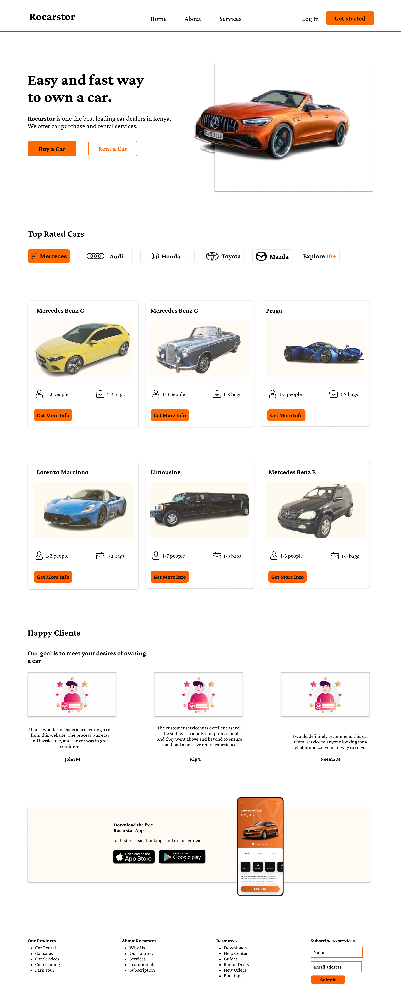

# Author name

Anita Mutemi

## Project name

Rocarstor- Car Website

## Description

The website is about Rocarstor car dealers. Rocarstor is one of the best leading car dealers in Kenya. They offer car purchase and rental services

## Installation

To set up the Rocarstor car website, follow these steps:

1. Format the HTML file by including relevant elements.
2. Format the CSS file for the website's design.
3. Use an external Git repository and provide the SSH path.
4. Make at least 20 commits in Git, with each change.
5. Push your commands and run the HTML and CSS files in a valid browser to view your website.

## Design

- 

The design for the portfolio website can be found in the attached image.

## Technologies Used

The portfolio car website is built using custom HTML and CSS. The following languages and tools were used:

- HTML5
- CSS3
- VS Code
- Git

## Contact

In case of any issues or questions regarding Rocarstor car dealers, you can reach out to the Moringa School website for support.

## License

Built by Anita. &copy; 2023 Markup Devops
